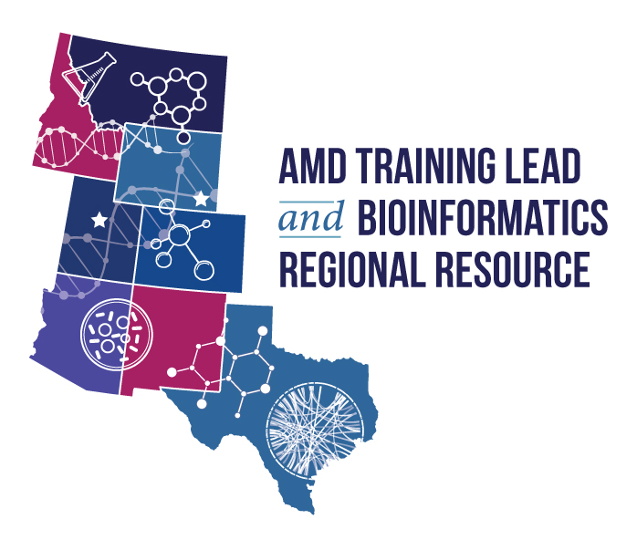

This resource was made possible through funding provided under the Epidemiology and Laboratory Capacity for Prevention and Control of Emerging Infectious Diseases (ELC) Cooperative Agreement (CK24-0002), Project D: Advanced Molecular Detection to the Utah Department of Health and Human Services. The conclusions, findings, and opinions expressed by authors do not necessarily reflect the official position of the U.S. Department of Health and Human Services, the Public Health Service, or the Centers for Disease Control and Prevention.

# Bioinformatics Resources for the AMD Mountain Region
[Training](Training/Training.md)

Mountain Region Members:

* Utah (Bioinformatics Regional Resource (BRR) Bioinformatics Training Lead (BTL))
* Colorado (Bioinformatics Regional Resource (BRR) Bioinformatics Training Lead (BTL))
* Montana
* Idaho
* Wyoming
* New Mexico
* Arizona
* Texas
